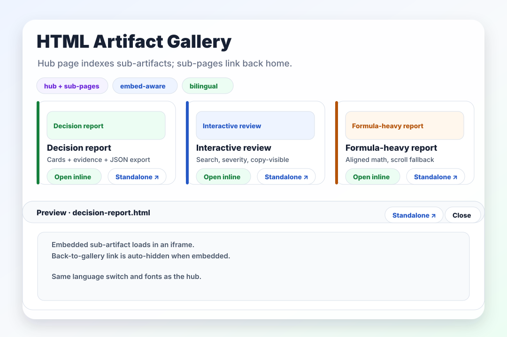
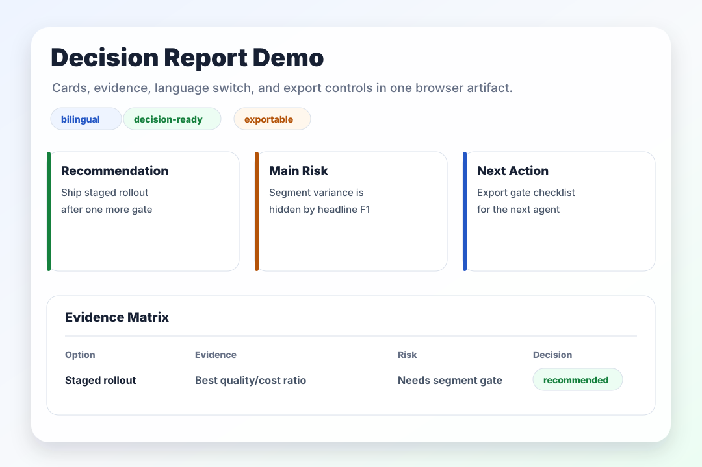
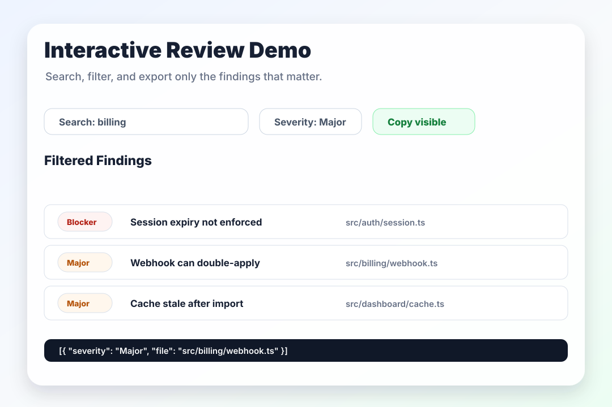
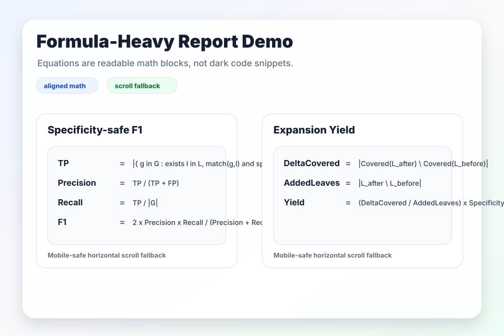

# HTML Artifact Skill

[English README](README.md)

HTML Artifact 工作流让 agent 输出从“文本计划”升级为“可读、可交互、可审阅的工作界面”。

核心思想不是用 HTML 替代 Markdown，而是：

> 当输出的目的不只是记录，而是帮助人理解、比较、决策、审阅、调整时，优先让 agent 生成 HTML Artifact。

Markdown 适合短文本、轻量笔记、README、简单说明。HTML 适合复杂信息、可视化、交互、评审、分享和决策。

HTML artifact 可以直接作为一等源文件维护。不要默认要求每个 HTML 都由 Markdown 生成；当用户编辑、发布或审阅已有 HTML artifact 时，应优先保留 HTML 本身，只把 Markdown 当作可选历史、附录或导出格式。

展示风格受 [trq212 的 X post](https://x.com/trq212/status/2052809885763747935) 启发。下面的预览图已随仓库提交，因此即使远程 embed 无法加载，README 仍然可读。

## 界面效果

### 首页（Gallery Hub）

[](examples/gallery/index.html)

首页索引所有子 artifact，支持在嵌入式 iframe 面板中预览，并把当前语言转发给子页面。每个子 artifact 顶部都提供返回首页的链接，并在被首页 iframe 嵌入时自动隐藏，避免与父页 UI 重复。

[打开 hub HTML](examples/gallery/index.html) · [中文 Prompt 示例](examples.zh-CN.md#hub-page-with-sub-artifacts)

### 决策报告

[](examples/gallery/decision-report.html)

卡片、证据矩阵、双语切换和导出按钮把长文本答案变成可以操作的决策界面。

[打开 demo HTML](examples/gallery/decision-report.html) · [中文 Prompt 示例](examples.zh-CN.md#general)

### 交互式 Review

[](examples/gallery/interactive-review.html)

搜索、筛选和导出控件帮助用户只查看真正重要的问题。

[打开 demo HTML](examples/gallery/interactive-review.html) · [中文 Prompt 示例](examples.zh-CN.md#pr-review)

### 公式密集报告

[](examples/gallery/formula-report.html)

指标定义和公式应渲染为可读的数学块，并保留窄屏 fallback。

[打开 demo HTML](examples/gallery/formula-report.html) · [中文 Prompt 示例](examples.zh-CN.md#formula-heavy-report)

## 方法论

### HTML-first content

当输入来自 Markdown、日志、JSON、表格或混合笔记时，默认把有用内容转换成浏览器原生 HTML 正文：

- 标题、列表、表格、引用、代码块、图和链接都应渲染为 HTML。
- 不要把完整内容藏在 `Original Markdown Source Appendix` 一类的 raw Markdown 附录里。
- 如果需要审计原始材料，可以加入 evidence/raw-data 区块，但它不应成为主要阅读路径。
- 导出优先提供 HTML、JSON、Prompt、Diff 或结构化数据；Markdown 导出只作为兼容选项。

### Bilingual output

持久化 artifact 和文档站点默认维护中英文两个阅读路径：

- 单文件 artifact：在同一个 HTML 中提供 `中文` / `English` 切换或双语视图。
- 多页面站点：维护平行路由，例如中文在 canonical path，英文在 `en/` 下。
- 页面应设置正确语言属性：`<html lang="zh-CN">` 和 `<html lang="en">`。
- 索引或 manifest 应显式记录双语路径，例如 `html_zh` 与 `html_en`。
- 如果英文正文尚未完成，也要创建英文入口并明确标注未翻译部分，不能假装已经完整本地化。

### Math and formulas

涉及指标、评分规则、概率、集合或算法定义时，公式应该作为数学内容呈现，而不是普通代码块：

- 优先使用 LaTeX delimiter：inline `\(...\)`，display `\[...\]` 或 `$$...$$`。
- 多行指标定义使用 aligned display，便于对齐等号和逐行阅读。
- 已存在的 `<div class="formula">...</div>` 纯文本公式块可以保留 source text，同时在浏览器中升级为 MathJax 或等价渲染。
- 公式区域需要横向滚动 fallback，避免移动端或窄屏把页面撑坏。

### 首页 + 子页面

当 HTML artifact 超过单页时，必须提供首页，并保证首页 ↔ 子页面之间的双向导航：

- 首页是 canonical 入口，用卡片列出每个子 artifact，包含简短说明、预览图和直达链接。
- 每张卡片提供两种打开方式：`嵌入预览`（在首页 iframe 面板里加载子页面，保留首页上下文）和 `独立打开`（在新标签页打开，便于复制链接或并排对比）。
- 每个子页面顶部都有 `← 返回首页` 链接。子页面通过 `window.top !== window.self` 检测是否被 iframe 嵌入；被嵌入时自动隐藏该链接，避免与父页 UI 重复。
- 首页通过 `postMessage` 把语言切换转发给被嵌入的子 artifact，保持跨 frame 的 locale 一致。
- 对于 docs site，首页可以等于 docs server 的 `index.html`。返回首页的链接必须在每个语言路由下都解析正确，例如 `/index.html` 和 `/en/index.html`。

### Durable docs sites

当 HTML artifact 发展成多页面文档站时，服务、翻译和缓存也属于 artifact 质量的一部分：

- 用统一入口索引所有 HTML artifact，并维护 `zh` / `en` 平行路由。
- 语言切换、公式支持、翻译状态条等共享 UI 可以注入 manual/standalone HTML，但不能替换原始正文。
- 只信任完整 HTML 文档缓存：至少应包含 `html/head/body`。坏缓存或片段不能覆盖完整 artifact。
- 请求时翻译应异步：先返回已有静态页面，再后台翻译并在完成后刷新。
- 历史翻译 backfill 应由慢轮询处理，不阻塞用户点击语言切换。
- 需要远程预览时，用 supervisor/hook 同时守护 docs server 和 tunnel（例如 ngrok），并记录当前 public URL。

## Cursor 使用方式

作为项目 skill 使用时，把这个仓库放在：

```text
.cursor/skills/html-artifact/
```

Cursor 会发现 `SKILL.md` 作为 skill 定义。

## 什么时候使用

适合使用 HTML artifact 的任务包括：

- 复杂计划或规格说明
- 架构决策
- 代码审阅或 PR 解释
- 长篇研究报告
- 事故报告
- 交互式编辑器
- 任务排序、分桶、打标或 prompt tuning
- 可视化比较

短说明、CLI 输出、简单 checklist、README 草稿和 prompt 草稿仍然适合 Markdown。

## 标准 Artifact 结构

一个好的 HTML artifact 通常包含：

1. Header：标题、目的、上下文、来源和日期。
2. Executive summary：3-5 条要点。
3. Navigation：tabs、sidebar 或锚点。
4. Main body：卡片、表格、图、代码片段、注释、时间线和风险。
5. Interactions：筛选、搜索、切换、滑块、折叠或拖拽。
6. Export area：复制 HTML、JSON、prompt、diff 或选中行。
7. Appendix：假设、原始数据、未解决问题和下一步。

## 工作流

1. 用 HTML exploration artifact 展开问题空间。
2. 让人类阅读、比较、调整和选择。
3. 把选定方向转换成 HTML implementation plan。
4. 实现时把 artifact 作为共享上下文。
5. 用 HTML review artifact 对照计划和当前 diff 验证。

## 文件

- `SKILL.md`: 英文 Cursor skill 定义。
- `SKILL.zh-CN.md`: 中文 skill reference。
- `examples.md`: 英文 prompt templates。
- `examples.zh-CN.md`: 中文 prompt templates。
- `examples/gallery/index.html`: 双语首页（hub），可嵌入预览每个 demo，也可以独立打开。
- `examples/gallery/`: README 链接的自包含 demo HTML，每个文件都带返回首页的链接，并在被首页 iframe 嵌入时自动隐藏该链接。
- `assets/readme/`: README gallery 使用的预览资产。
- `scripts/render-readme-assets.py`: 无依赖 README 预览资产生成器。
